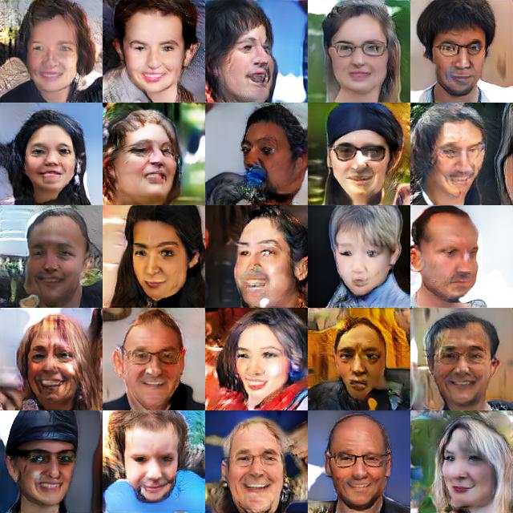
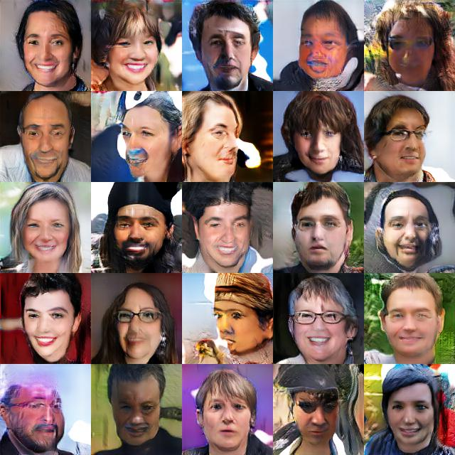
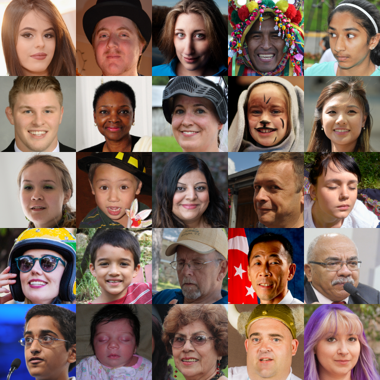
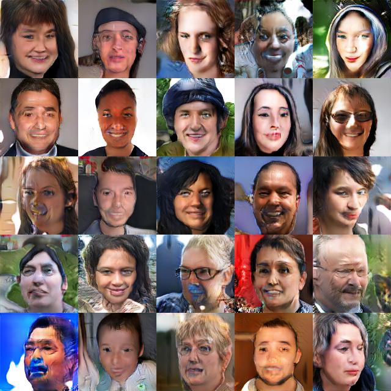

# ALI-GAN

A simple tensorflow implement of [Adversarially Learned Inference](https://arxiv.org/abs/1606.00704) on FFHQ Datasets


## Requirements

 - Tensorflow (tested with v1.12.0)
 - Python3


## Download datasets

- `ffhq-r07.tfrecords` - 3GB, as described in A Style-Based Generator Architecture for Generative Adversarial Networks.

- Download from (https://drive.google.com/drive/folders/1M24jfI-Ylb-k2EGhELSnxssWi9wGUokg), and then splits the dataset into two parts, that is, training dataset and test dataset


## Run

```
python train.py --data_dir_train PATH TO YOUR TRAIN Dataset --data_dir_test PATH TO YOUR TRAIN Dataset
```

# Result

## Sampling

 

## Reconstruction

 


Some codes are directly borrowed from [ProGAN](https://github.com/tkarras/progressive_growing_of_gans)